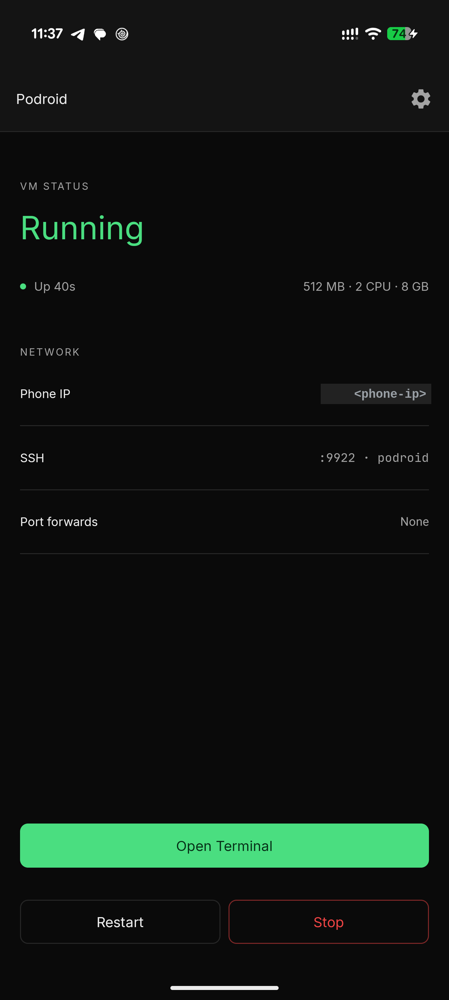
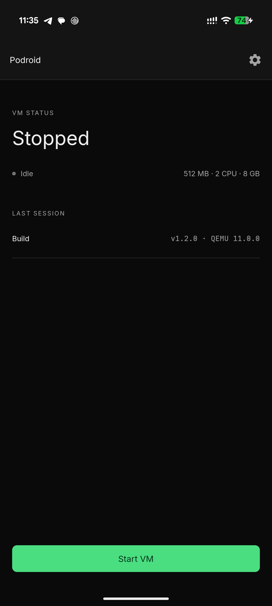
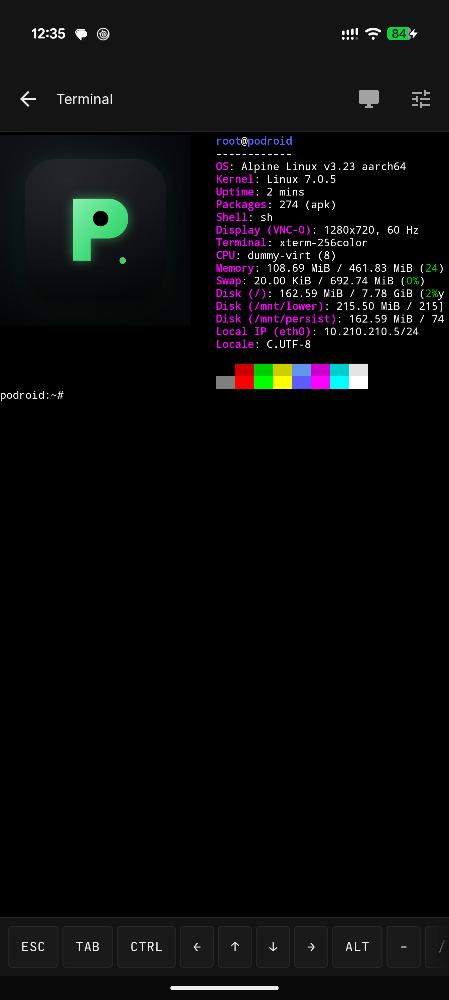
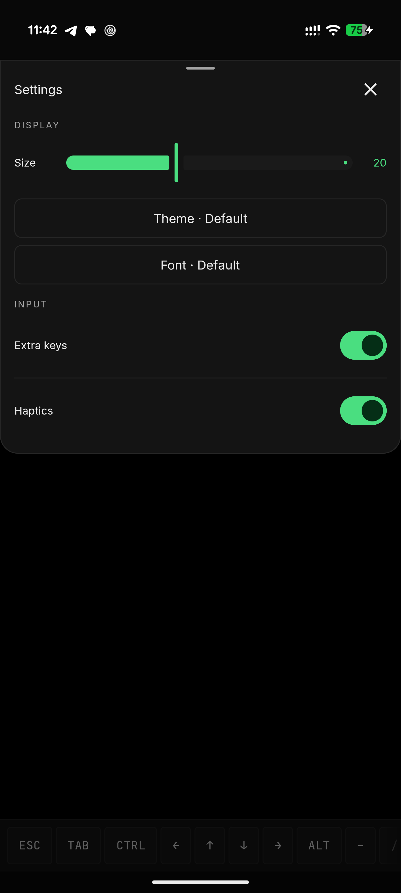
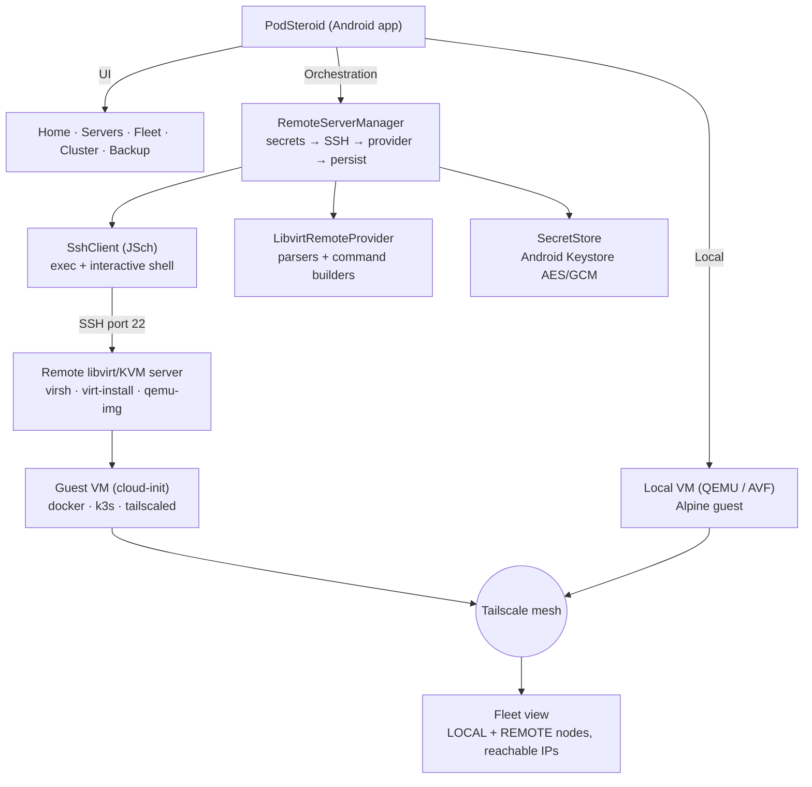

<p align="center">
  
</p>

<h1 align="center">PodSteroid</h1>

<p align="center">
  <b>Run Linux VMs and a full Linux desktop on your Android phone — no root.<br/>
  Plus manage remote libvirt/KVM servers, weave them into a Tailscale mesh,<br/>
  and form multi-node k3s clusters, all from one app.</b>
</p>

<p align="center">
  <a href="LICENSE"></a>
  
  
  
  <a href="https://github.com/ExTV/Podroid"></a>
</p>

---

> **PodSteroid is a further work on [ExTV/Podroid](https://github.com/ExTV/Podroid)** — it keeps
> everything Podroid does locally and adds **remote-server VM management, a unified Fleet view,
> and k3s clustering**. It is released under the **same license as Podroid: GPL-2.0** (see
> [License](#license)).

> ⚠️ **Work in progress.** PodSteroid's *local* VM features are solid. **Adding a remote Linux
> server** (registering a libvirt/KVM host and provisioning VMs on it) is **currently buggy and
> under active development** — expect rough edges and breakage. See
> [Known limitations](#-known-limitations--work-in-progress).

---

## 📑 Table of contents

- [What is PodSteroid?](#what-is-podsteroid)
- [Features](#-features)
- [Architecture](#️-architecture)
- [Installation](#-installation)
- [Usage](#-usage)
  - [Local VM](#local-vm-on-your-phone)
  - [Remote servers](#remote-servers)
  - [Fleet](#fleet)
  - [Remote terminal](#remote-terminal)
  - [k3s cluster](#k3s-cluster)
- [Tailscale setup](#-tailscale-setup)
- [Local same-network setup](#-local-same-network-setup)
- [Known limitations / Work in progress](#-known-limitations--work-in-progress)
- [Acknowledgements](#-acknowledgements)
- [License](#license)
- [Contributing](#-contributing)

---

## What is PodSteroid?

PodSteroid boots a **real Alpine Linux VM with its own kernel** on your Android phone — not a
chroot or proot trick — so **Podman, Docker and LXC** behave exactly like they do on a server.
On top of that, it turns any SSH-reachable **libvirt/KVM host** (a PC, a mini-PC, a server in your
closet) into managed compute: create and run VMs on it, reach them through a **Tailscale** mesh,
open a **remote terminal**, and stitch everything into a **multi-node k3s cluster**.

- **Local compute** (inherited from Podroid): QEMU/TCG on any arm64 phone, or hardware-accelerated
  AVF on supported pKVM devices.
- **Remote compute** (the new part): register libvirt/KVM servers over SSH, manage VMs on them, and
  treat them like local ones in a single Fleet view.

---

## 🖼️ Screenshots

<p align="center">
  
  
  
  
</p>

---

## ✨ Features

**Local VM (from Podroid)**
- 🐧 **A real Alpine Linux VM** with a custom kernel via QEMU, or hardware-accelerated **AVF** on
  supported pKVM devices — no root required.
- 📦 **Podman, Docker and LXC** pre-installed and ready the moment it boots.
- 💻 **In-app terminal** — full `xterm-256color`, 120+ color themes, 13 fonts, live resize.
- 🖥️ **X11 desktop** — run GUI Linux apps in a built-in viewer with touch, keyboard, mouse and audio.
- 🔌 **USB passthrough**, **SSH** (`root@<phone-ip> -p 9922`), **port forwarding** and a
  **guest-to-Android bridge**.
- 💾 **Container backup**, a **live VM/device status view**, and **Downloads-folder sharing**.
- 🌐 **English and 中文**, any arm64 device on Android 8+.

**Remote servers (new in PodSteroid)**
- 🖧 **Register remote libvirt/KVM servers** over SSH (password or private-key auth), with secrets
  encrypted in the Android Keystore.
- 🚀 **Create / start / stop / destroy VMs** on a remote server from the app, with cloud-init
  provisioning of the container runtime, Tailscale, and k3s.
- 🗺️ **Fleet** — a single view that aggregates your *local* VMs and *all* your remote VMs, each with
  a stable, reachable address.
- 🔑 **Remote terminal** — an interactive SSH shell straight into any running guest.
- ☸️ **k3s clustering** — bootstrap a multi-node control plane + workers across the fleet with a
  few taps.

---

## 🏗️ Architecture



---

## 📦 Installation

### Option A — Build from source

Requirements: **Docker**, the **Android SDK + NDK**, and a Linux/macOS host.

```bash
git clone https://github.com/<your-user>/podsteroid.git
cd podsteroid
./build-all.sh all          # kernel, rootfs, QEMU and the APK
# or build just the app after the native pieces are present:
./build-all.sh apk
```

Install the resulting APK on your phone:

```bash
adb install -r app/build/outputs/apk/debug/app-debug.apk
```

> The native libraries, kernel image and Alpine rootfs are produced by `build-all.sh` and the
> `build-rootfs` tooling. They are intentionally **not** checked into the repo (binaries/cache).

### Option B — Prebuilt APK

Grab the latest release from the **Releases** page of this repository and install it on an
arm64 phone running Android 8 or newer. No root required.

---

## 🚀 Usage

### Local VM (on your phone)

1. Open the app and tap **Start VM**.
2. Wait for **Ready!**, then open the terminal.

```bash
# rootless containers, straight away
podman run --rm alpine echo "hello from a container"
docker run -d -p 8080:80 nginx

# expose that container to your phone and LAN, right from the VM shell
podroid-forward add 8080 8080 tcp
curl http://<phone-ip>:8080
podroid-forward clean

# SSH in from your laptop (enable SSH in the setup wizard or Settings)
ssh root@<phone-ip> -p 9922        # password: podroid
```

### Remote servers

> ⚠️ **This part is a work in progress and can be buggy** (see
> [Known limitations](#-known-limitations--work-in-progress)).

1. **Home → Servers → +** and fill in the dialog:

   | Field | Meaning |
   |---|---|
   | **Name** | Friendly label (e.g. `lab-kvm-01`). |
   | **Host** | IP/hostname of the libvirt server (reachable from the phone). |
   | **Port** | SSH port (default `22`). |
   | **Username** | SSH user able to run `virsh` (usually in the `libvirt` group). |
   | **Guest arch** | `amd64` or `arm64` (selects the cloud image + Tailscale binary). |
   | **Network** | libvirt network the VM attaches to (default `default`). |
   | **Auth** | **Password** or **Private key** (+ optional key passphrase). |

2. Tap **Add**. The secret is encrypted in the Android Keystore immediately; only a ciphertext
   token is persisted.
3. Tap **Test** to run the prerequisite probe (`virsh`, `virt-install`, `qemu-img`, cloud-init,
   `default` network). Green chips = ready; red chips tell you what to install.

> **Security:** the server's SSH host key is pinned on first successful connection
> (accept-first-use). If it ever changes, the connection fails with a possible-MITM error — fix by
> removing and re-adding the server.

### Fleet

From **Home → Fleet** you get one list of **local** VMs and **remote** VMs together, each tagged
`LOCAL` / `REMOTE`, with its state, distro, container runtime, and a reachable address (Tailscale
IP preferred). **Refresh Tailscale** re-probes every running remote VM's Tailscale IP.

### Remote terminal

Tap **Terminal** on a running remote VM to open an interactive SSH shell (PTY) to
`root@<tailscaleIp|guestIp>:22` (password `podsteroid`). Close the dialog to disconnect.

### k3s cluster

1. **Home → Fleet → Form cluster.**
2. Pick a **control node** (a running remote VM that will run the k3s *server*; best created with
   `containerRuntime = k3s`).
3. Tick the **worker** VMs (other running remote VMs).
4. **Get join token** → the app reads the control node's
   `/var/lib/rancher/k3s/server/node-token`.
5. **Join selected** → the app runs the k3s agent join command inside each worker, pointing
   `K3S_URL` at the control node's **Tailscale IP** so workers reach it across the mesh.

---

## 🔒 Tailscale setup

Tailscale gives every VM a stable, encrypted address and NAT traversal for free — it is the
**recommended transport for cross-node traffic** (and required for k3s clustering across networks).

1. Create a Tailscale network at [tailscale.com](https://tailscale.com) and generate an **auth key**
   (Settings → Keys → Generate auth key).
2. When you create a remote VM, enable **Tailscale**. `tailscaled` is installed inside the guest by
   cloud-init.
3. Bring the node up with the auth key (manual step for now, or wire
   `tailscaleAuthKeyRef` into cloud-init):

   ```bash
   # inside the guest
   tailscale up --authkey tskey-xxxxxxxxxxxx
   ```

4. Once up, the app discovers the guest's Tailscale IP over SSH (`tailscale ip -4`) and shows it as
   the **reachable address** in Fleet. The remote terminal and the k3s join both prefer this IP.

> **Tip:** use Tailscale **auth keys** instead of the hardcoded `root/podsteroid`, and ACL/firewall
> the Tailscale network so only intended nodes mesh. Treat your Android device as holding the keys
> to your fleet — lock the app (biometric gate) and the device.

---

## 🏠 Local same-network setup

If your phone and the libvirt server are on the **same LAN** (no Tailscale yet), you can still
manage the server:

- **Server connection:** the app reaches the libvirt host over SSH using its **LAN IP / hostname**
  (e.g. `192.168.1.50`). No VPN needed for the SSH control channel.
- **Guest reachability:** by default a VM attaches to libvirt's `default` NAT network, so the guest
  gets an address like `192.168.122.x`. The app can fall back to this **libvirt IP** for the remote
  terminal and Fleet — but only if your phone can actually route to that subnet. From a phone on
  `192.168.1.x`, the `192.168.122.0/24` guest network is usually **not** directly reachable without
  extra routing.
- **When to use Tailscale instead:** as soon as nodes live on different subnets, across NAT, or you
  want k3s clustering to "just work", use the [Tailscale setup](#-tailscale-setup) above.

**Quick path:** same LAN → connect the server by its LAN IP; reach guests either by their libvirt
IP (if routable) or by enabling Tailscale on the guest for a stable, always-reachable address.

---

## 🚧 Known limitations / Work in progress

PodSteroid is under active development. Honest gaps:

- ⚠️ **Adding a remote Linux server is buggy and a work in progress.** Registering a libvirt/KVM host
  and provisioning VMs on it can fail or behave unexpectedly. Local VM usage is stable; the remote
  path is where the rough edges live right now.
- **Guest credentials are simple.** Cloud-init sets `root` / `podsteroid` so the app can reach guests
  without per-guest secret management. Treat the **Tailscale network as the trust boundary** and use
  an auth key / firewall it.
- **Tailscale login is not yet automated.** `tailscaled` is installed but `tailscale up --authkey`
  is a manual step (or wire `tailscaleAuthKeyRef` into cloud-init).
- **k3s `--node-ip` is a placeholder.** It currently binds to loopback unless wired to the discovered
  guest/Tailscale IP.
- **Local-VM Tailscale discovery** needs a guest-side `NETINFO` push that is not yet built into the
  rootfs; local fleet nodes show `no routable address yet` until then (they still start/stop fine).
- **`initK3sServer` is best-effort** — the k3s *server* is not yet persisted as an OpenRC service, so
  it won't survive a guest reboot.

None of these block the local VM happy path. See `docs/remote-servers/` for the full design and
`docs/development-log.md` for the change history.

---

## 🙏 Acknowledgements

PodSteroid is a **further work on [ExTV/Podroid](https://github.com/ExTV/Podroid)** — an outstanding
rootless Android VM project. PodSteroid extends it with remote-server management, Fleet, and k3s
clustering, and is released under the **same GPL-2.0 license**.

Built on the shoulders of:
- [QEMU](https://www.qemu.org) — machine emulation
- [Termux](https://github.com/termux/termux-app) — terminal emulator engine
- [Alpine Linux](https://alpinelinux.org) — the guest distribution
- [k3s](https://k3s.io) — lightweight Kubernetes
- [Tailscale](https://tailscale.com) — zero-config mesh networking

Full list in [CREDITS.md](CREDITS.md).

---

## License

**GNU General Public License v2.0 (GPL-2.0)** — the same license as
[ExTV/Podroid](https://github.com/ExTV/Podroid).

This program is free software; you can redistribute it and/or modify it under the terms of the GPL
as published by the Free Software Foundation. See [LICENSE](LICENSE) for the full text.

---

## 🤝 Contributing

Contributions of every size are welcome. Read [CONTRIBUTING.md](CONTRIBUTING.md) first, keep changes
scoped, run `./build-all.sh test` before pushing, and explain *why* in the PR description.

Bug reports: open an issue with your device and Android version, a short repro, and the diagnostic
log (**Settings → Export Diagnostic Log** in the app).
