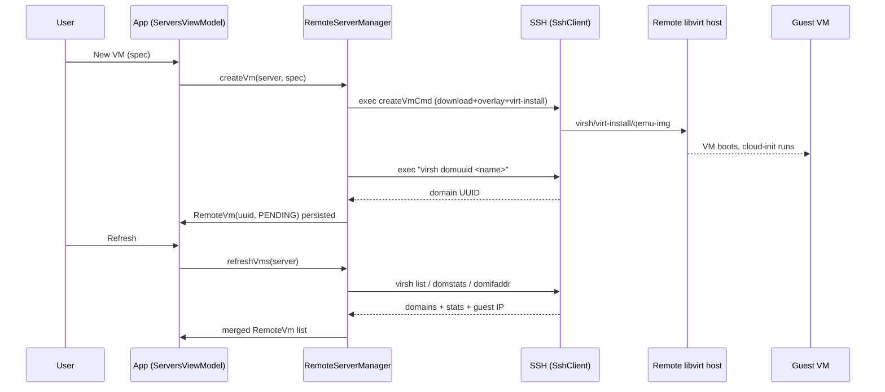
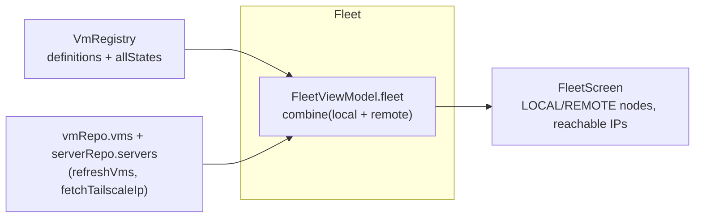
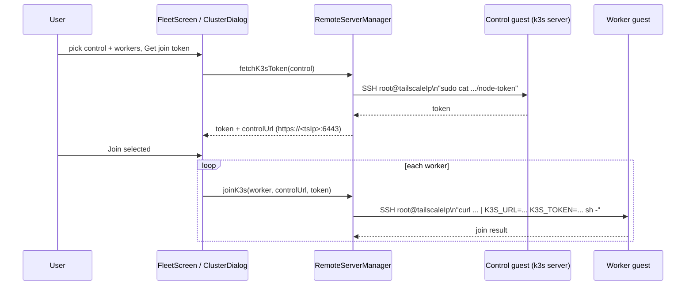

# PodSteroid Remote Servers — Usage Guide

Step-by-step guide to registering a remote libvirt server, creating and managing
VMs on it, reaching them through Tailscale, opening a remote terminal, and
forming a k3s cluster. Also covers prerequisites and troubleshooting.

---

## 0. Prerequisites on the remote server

PodSteroid drives the server over **SSH** using `virsh`, `virt-install`, and
`qemu-img`. On the server (Debian/Ubuntu example):

```bash
# install libvirt + tools
sudo apt-get update
sudo apt-get install -y qemu-kvm libvirt-daemon-system libvirt-clients \
     virtinst cloud-image-utils

# enable + start libvirtd
sudo systemctl enable --now libvirtd

# confirm the default NAT network exists
virsh net-info default        # should report active

# allow your SSH user to use libvirt (add to libvirt group)
sudo usermod -aG libvirt "$USER"
# re-login afterwards

# (optional but recommended) Tailscale on the *host* is NOT required;
# Tailscale is installed *inside each guest* by cloud-init.
```

The app probes these during **Test Connection** and reports which are missing
(`virsh`, `virt-install`, `qemu-img`, cloud-init support, `default` network).

> **Architecture note:** pick the guest arch that matches the server CPU
> (amd64 for x86 servers, arm64 for Ampere/Apple-Silicon-class hosts). The
> default base image and the Tailscale binary are selected from this.

---

## 1. Add a server

1. Open the app → **Home** → **Servers** (top-right) → **+** (FAB).
2. Fill the dialog:

   | Field | Meaning |
   |---|---|
   | Name | Friendly label (e.g. `lab-kvm-01`). |
   | Host | IP/hostname of the libvirt server (reachable from the phone). |
   | Port | SSH port (default `22`). |
   | Username | SSH user (must be able to run `virsh` — usually in `libvirt` group). |
   | Guest arch | `amd64` or `arm64` (selects cloud image + Tailscale binary). |
   | libvirt network | Network the VM attaches to (default `default`). |
   | Auth | **Password** or **Private key** (+ optional key passphrase). |
   | Base image URL | Optional override; otherwise an Ubuntu jammy cloud image for the arch. |

3. Tap **Add**. The secret is encrypted in the Android Keystore immediately;
   only a ciphertext token is persisted.
4. The server appears in the list. Tap **Test** to run the prerequisite probe.
   A green chip set means you're ready; red chips tell you what to install.

> **Security:** the server's SSH host key is pinned on first successful
> connection (accept-first-use). If it ever changes, the connection fails with a
> possible-MITM error — re-accept by removing and re-adding the server.

---

## 2. Create a VM

1. On a server card, tap **New VM**.
2. `RemoteVmCreateDialog` fields:

   | Field | Notes |
   |---|---|
   | Name | libvirt domain name (unique on that server). |
   | Guest distro | informational label (default `debian`). |
   | vCPU / RAM (MB) / Disk (GB) | VM sizing. |
   | Container runtime | `Docker`, `k3s`, `Both`, or `None` — installed via cloud-init `runcmd`. |
   | Tailscale | if enabled, `tailscaled` is installed in the guest. |
   | SSH enabled | informational. |

3. Tap **Create**. The app runs, over SSH:
   - download the base image (cached by URL hash under
     `/var/lib/libvirt/images/`),
   - `qemu-img create` a qcow2 overlay,
   - `virt-install --import --cloud-init user-data=/tmp/ud-<name>.yaml`,
   - `virsh domuuid` to capture the stable libvirt UUID.
4. The VM is persisted with `state = PENDING`. Tap **Refresh** to pick up its
   real state, specs, and guest IP.



---

## 3. Manage VMs

Each remote VM row has:

- **Start** (when shut off) → `virsh start <name>`.
- **Stop** (when running) → `virsh shutdown <name>`.
- **Terminal** (when running) → opens the remote terminal (§4).
- **Destroy** → `virsh destroy` + `virsh undefine --remove-all-storage`
  (deletes the disk image and the persisted record).

State and guest IP are only as fresh as the last **Refresh**; the app does not
poll remote servers continuously.

---

## 4. Remote terminal

Tap **Terminal** on a running VM. The app opens an interactive SSH **shell
channel** (PTY) to `root@<tailscaleIp|guestIp>:22` (password `podsteroid`). You
get a scrollable terminal; type a command and tap **Send**. Closing the dialog
disconnects the shell.

> The guest must be reachable: prefer its **Tailscale IP** (set after Tailscale
> login). If Tailscale isn't up, the app falls back to the libvirt `default`
> network IP, which is only routable if the phone can reach that subnet.

---

## 5. Fleet (cross-VM view)

From **Home → Fleet**:

- Lists **local** VMs (from `VmRegistry`) and **remote** VMs (from the servers)
  together, each tagged `LOCAL` / `REMOTE`, with state, distro, container
  runtime, and a **reachable** address (Tailscale IP preferred).
- **Refresh Tailscale** re-probes every running remote VM's Tailscale IP over
  SSH (`tailscale ip -4`) and persists it.
- A node with no routable address shows
  `no routable address yet (needs Tailscale / guest push)`. Remote guests get
  this automatically once Tailscale is up; **local** VMs need the guest-side
  `NETINFO` push (see ReadMe §6, not yet built into the rootfs).



---

## 6. Form a k3s cluster

1. **Home → Fleet → Form cluster.**
2. Select a **control node** (running remote VM that will run the k3s *server*).
   For a clean cluster, create it with `containerRuntime = k3s` (or install k3s
   manually inside the guest).
3. Tick the **worker** VMs (other running remote VMs).
4. **Get join token** → the app SSHes into the control guest and reads
   `sudo cat /var/lib/rancher/k3s/server/node-token`. The join command is shown:
   ```
   curl -sfL https://get.k3s.io | K3S_URL=https://<controlTailscaleIp>:6443 K3S_TOKEN=<token> sh -
   ```
5. **Join selected** → the app runs that command inside each worker guest,
   pointing `K3S_URL` at the control node's **Tailscale IP** so workers reach it
   across the mesh.



> **Reachability is the whole point of Tailscale here.** Without it, workers
> can't reach the control plane across NAT/subnets.

---

## 7. Troubleshooting

| Symptom | Cause / Fix |
|---|---|
| Test fails immediately with "Missing stored secret" | Server was added without a secret, or DataStore/Keystore lost the token. Re-add the server. |
| `virsh` chip red | Install `libvirt-clients` on the server; ensure the SSH user is in the `libvirt` group and re-login. |
| `cloud-init` chip red | Use a `virt-install` new enough for `--cloud-init` (Debian ≥11 / Ubuntu ≥20.04 usually fine). |
| `default` net chip red | `virsh net-start default` (and `virsh net-autostart default`). |
| VM created but never shows Running | Tap **Refresh**; check `virsh list --all` on the server; view `virsh domifaddr`. |
| Terminal / cluster "no reachable IP" | Ensure Tailscale is up in the guest (`tailscale up --authkey …`); the app needs the Tailscale IP (or a routable libvirt IP). |
| Host-key error after server reinstall | Server SSH host key changed → remove & re-add the server to re-pin. |
| Local fleet node has no address | Expected until the guest-side `NETINFO` push is built (ReadMe §6). Local VMs still start/stop fine. |
| k3s join fails | Confirm the control VM actually runs a k3s *server* (token exists) and Tailscale is up on both nodes. |

---

## 8. Security checklist for production use

- [ ] Use **Tailscale auth keys** instead of relying on the hardcoded
      `root/podsteroid` (wire `tailscaleAuthKeyRef` into cloud-init's
      `tailscale up --authkey`).
- [ ] Firewall/ACL the Tailscale network so only intended nodes mesh.
- [ ] Prefer **SSH key** auth for the server (not password); store the key
      encrypted in the Keystore (already done).
- [ ] Treat the Android device as holding the keys to your fleet — lock the app
      (biometric gate) and the device.
